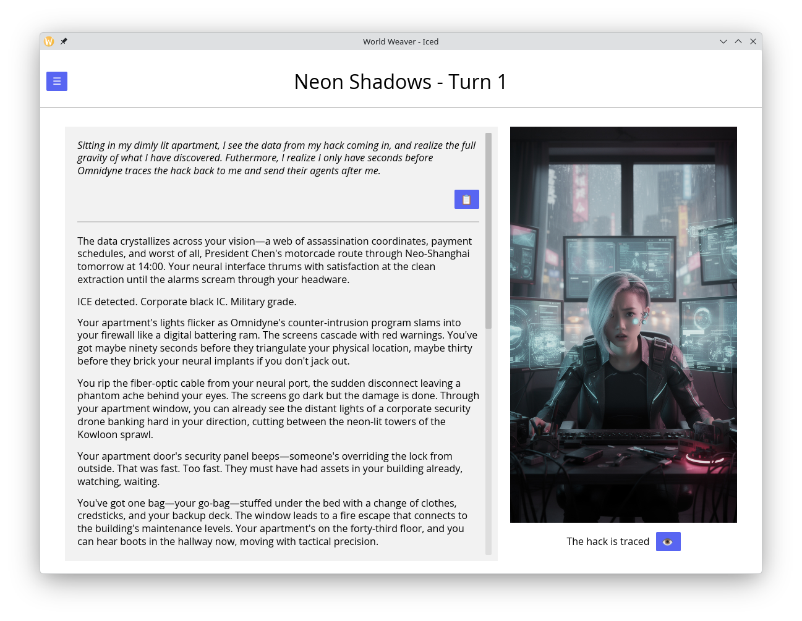
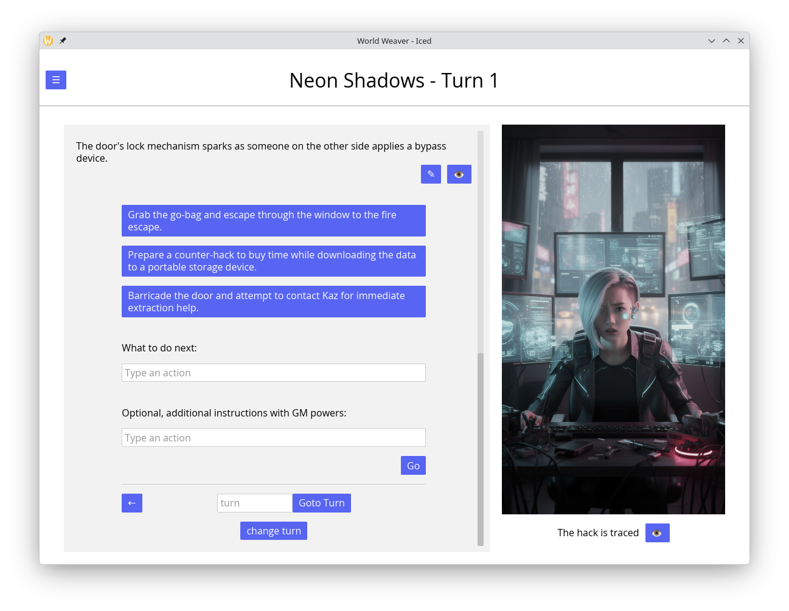

# World Weaver

World Weaver is an AI-Guided Choose your own Adventure game, also known as "Infinite World Game".



While this program is free, you will need to pay for the AI. The used LLM is Claude Sonnet 4.5.
For the image model you can choose between Flux1 and Flux2. To play you need to create
accounts and API-keys at <https://claude.com/platform/api> and <https://replicate.com/>.
You can also use Flux2 hosted by Black Forrest Labs, but that costs roughly twice as much
as using Flux2 via Replicate. The API keys must then be configured in the game's option menu.
Flux 1 is slower (~1 minute per request). Flux 2 is faster (~20s) and moderated.


## Installation

I wrote this mostly for myself, and now publish it basically as a "Portfolio-piece", so
I didn't put in effort into stuff I don't need. Like prebuild binaries.
If you're not a programmer, but want to use it, do the following:

1. Install Rust: <https://rustup.rs/> (always use the latest stable version)
2. Open a new terminal and run
    ```
      cargo install --locked --git https://github.com/KnorrFG/world_weaver world_weaver
    ```
3. Now you can run this by simply typing `world_weaver` into your terminal
4. You might have to install additional dependencies that are required by [iced](https://github.com/iced-rs/iced),
   Error messages when attempting to start World Weaver should be instructive.
   I'd love to be more precise here, but the iced dependencies vary by platform, and
   I couldn't find an explicit list.

**Disclaimer:** I only tested on Arch-Linux. The code *should* be platform independent,
but honestly, if it works flawlessly on Mac or Windows, I'd be surprised.

## Usage

All the Menus should be pretty self-explanatory, but let's focus on the main UI for
a second:



- The button in the upper left corner of the screen takes you to the menu.
- The button with the pencil below the text will allow you to edit the output text. This way, if you
  don't like something the AI generated, you can change it without paying for another
  generation.
- The eye button next to it will allow you to look at and edit secret information for the current
  turn. Using that is basically cheating.
- The eye button below the image will show you the description that was sent to the Image UI.
  Well to be exact, it's the description that was generated by the LLM, the description that is
  sent to the image AI is possibly prefixed and postfixed with additional information. This is
  called *Styles* and can be configured in the Option menu
- The 3 bit text-buttons are proposed actions. If you click them once, their content is copied
  into the action-text-edit. If you press them again, the action is submitted
- Below those, there is the action-text-edit, here you can type whatever you want to do next.
- Next comes the GM-instructions-edit. Here you can give the AI instructions about the next
  generated turn that it will follow as good as it can. I barely ever use it, but sometimes it's
  handy.
- The go button will submit the turn. Alternatively, you can press enter in one of the text-edits
- You can go back in time, like your browsers back button, this won't lose your progress.
- The change turn button gives you a menu where you can describe how the current turn should change,
  then the LLM will take a new attempt at it. I use it occasionally, when the LLM did something I
  fundamentally disliked.

## For Devs

There are a few features missing I simply don't need myself:

- exporting world from save
- edit/delete worlds
- delete saves

I'm open for PRs, but I also reserve the right to reject them if I dislike them.
If you want to make a PR, take a look at the [Architecture](doc/architecture.md) first.
And make sure the tests pass, CIs are a huge PITA, but I'll run the tests manually.
